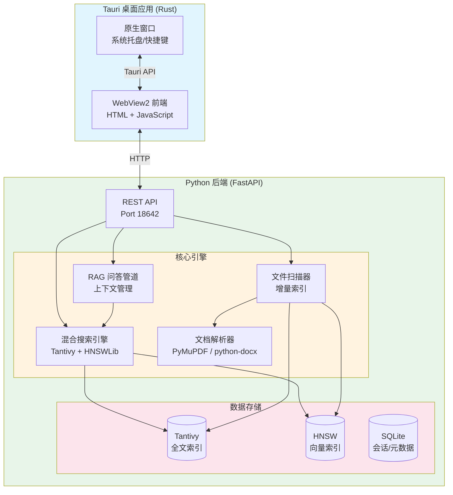

# FileTools

<p align="center">
  
</p>

<p align="center">
  <b>在海量文件中瞬间找到你需要的内容</b>
</p>

<p align="center">
  <a href="LICENSE"></a>
  <a href="VERSION"></a>
  <a href="pyproject.toml"></a>
</p>

---

## 问题：文件越多，找得越慢

- 🔍 记得文件中写过某个内容，但想不起文件名
- 📁 文档散落在多个文件夹，每次都要逐个打开查找
- 🤔 想快速了解一批文档的核心内容，却没时间逐一阅读
- 🔒 担心云端搜索工具泄露敏感文件内容

## 解决方案

FileTools 在本地构建智能索引，让你用自然语言快速搜索和提问：

```
搜索: "去年关于预算的Excel表格"
→ 瞬间找到相关文件，即使文件名不含"预算"

提问: "总结一下这个项目的主要风险点"
→ 自动检索相关文档并生成答案
```

## 快速开始

### 1. 下载安装

| 平台 | 下载 | 说明 |
|------|------|------|
| Windows | [NSIS 安装包](https://github.com/Dry-U/File-tools/releases) (.exe) | 推荐，自动创建桌面快捷方式 |
| Windows | [MSI 安装包](https://github.com/Dry-U/File-tools/releases) (.msi) | 企业部署 |
| Linux | [AppImage](https://github.com/Dry-U/File-tools/releases) / DEB | 开箱即用 |
| macOS | [DMG](https://github.com/Dry-U/File-tools/releases) | 拖拽安装 |

**系统要求**: Windows 10/11 / macOS 10.15+ / Ubuntu 20.04+ | 8GB RAM

### 2. 首次配置

启动应用后，点击设置选择要索引的文件夹：

```yaml
# 在设置面板中添加扫描路径
file_scanner:
  scan_paths:
    - "C:/Users/YourName/Documents"
    - "D:/Projects"
```

### 3. 开始使用

| 功能 | 操作 |
|------|------|
| **搜索** | 输入关键词，支持语义匹配（如搜"费用"也能找到"支出"相关的文档） |
| **问答** | 切换到"智能问答"模式，直接问文档内容 |
| **预览** | 点击搜索结果直接查看文件内容，无需打开原应用 |

---

## 效果演示

### 混合搜索
输入 `"第三季度销售报告"`，即使文件名是 `Q3_sales_final.xlsx` 也能找到：

```
┌─────────────────────────────────────────────────┐
│  🔍 第三季度销售报告                              │
├─────────────────────────────────────────────────┤
│  1. Q3_sales_final.xlsx     [匹配度: 95%]        │
│     标签: Excel · 2.3MB · 修改于 3天前           │
│                                                   │
│  2. 销售部-三季度总结.pptx   [匹配度: 87%]        │
│     标签: PPT · 5.1MB · 修改于 1周前             │
└─────────────────────────────────────────────────┘
```

### 智能问答
询问 `"这个项目的预算超支了吗？"`，系统自动检索相关文档并回答：

```
┌─────────────────────────────────────────────────┐
│  🤖 这个项目的预算超支了吗？                      │
├─────────────────────────────────────────────────┤
│  根据 Q3_sales_final.xlsx 和 预算审核.docx        │
│  的内容，该项目目前：                              │
│                                                   │
│  ✅ 未超支，实际支出为预算的 85%                  │
│                                                   │
│  📎 来源引用:                                     │
│     - 表格 "实际支出汇总" (Q3_sales_final.xlsx)   │
│     - 第3段 (预算审核.docx)                      │
└─────────────────────────────────────────────────┘
```

---

<details>
<summary><b>🔐 安全与隐私说明</b> (点击展开)</summary>

### 数据安全
- **纯本地运行**: 所有索引和文档内容存储在本地磁盘，不上传云端
- **本地 AI 可选**: 支持通过 WSL 运行本地 LLM，无需联网即可问答
- **文件访问**: 只读取配置目录下的文件，不会扫描系统目录

### 系统权限
| 操作 | 说明 |
|------|------|
| 文件读取 | 仅扫描用户指定的文件夹 |
| 网络访问 | 仅用于远程 AI API（可选） |
| 系统托盘 | 最小化到托盘，方便快速启动 |

### 完全卸载
```powershell
# Windows
卸载程序: 设置 → 应用 → FileTools → 卸载
数据目录: %APPDATA%/com.filetools.app (可选删除)

# macOS
卸载: 将 FileTools.app 拖入废纸篓
数据目录: ~/Library/Application Support/com.filetools.app

# Linux
卸载: sudo apt remove filetools 或删除 AppImage
数据目录: ~/.local/share/filetools
```

</details>

<details>
<summary><b>⚙️ 工作原理</b> (点击展开)</summary>

### 技术架构



### 混合检索
同时使用两种技术确保搜索结果准确：
1. **BM25 全文检索**: 精确匹配关键词
2. **语义向量检索**: 理解查询意图，找到相关但关键词不匹配的内容
3. **RRF 融合排序**: 综合两种结果的排名

### 支持的文件格式
- **文档**: PDF, Word (.doc/.docx), TXT, Markdown
- **表格**: Excel (.xls/.xlsx), CSV
- **演示**: PowerPoint (.ppt/.pptx)
- **图片**: 支持 OCR 提取文字（需要配置）

</details>

<details>
<summary><b>🛠️ 开发者信息</b> (点击展开)</summary>

### 从源码构建
```bash
# 克隆项目
git clone https://github.com/Dry-U/File-tools.git
cd File-tools

# 安装依赖
uv sync
npm install

# 开发模式
npm run tauri dev

# 发布构建
npm run tauri build
```

### 技术栈
| 组件 | 技术 |
|------|------|
| 桌面框架 | Tauri 2.x (Rust) |
| 后端 API | FastAPI (Python) |
| 全文检索 | Tantivy (Rust) |
| 向量检索 | HNSWLib |
| 嵌入模型 | fastembed |

### 完整文档
- [使用指南](docs/USAGE_GUIDE.md) - 详细功能说明
- [开发者指南](docs/DEVELOPER_GUIDE.md) - 架构设计与 API 文档
- [贡献指南](docs/CONTRIBUTING.md) - 如何参与开发

</details>

---

## 常见问题

**Q: 索引会占用多少磁盘空间？**  
A: 约为原始文档大小的 10-20%。10GB 文档约需 1-2GB 索引空间。

**Q: 支持多少文件数量？**  
A: 测试支持 10 万+ 文档，检索延迟 < 1 秒。

**Q: 文件修改后索引会自动更新吗？**  
A: 是的，启用监控后，文件变更会在后台自动增量更新索引。

**Q: 可以用自己的 AI 模型吗？**  
A: 支持。可配置 OpenAI API、SiliconFlow、DeepSeek 或通过 WSL 使用本地模型。

---

## 许可证

MIT License - 详见 [LICENSE](LICENSE)

---

<p align="center">
  如有问题或建议，欢迎提交 <a href="https://github.com/Dry-U/File-tools/issues">Issue</a>
</p>
