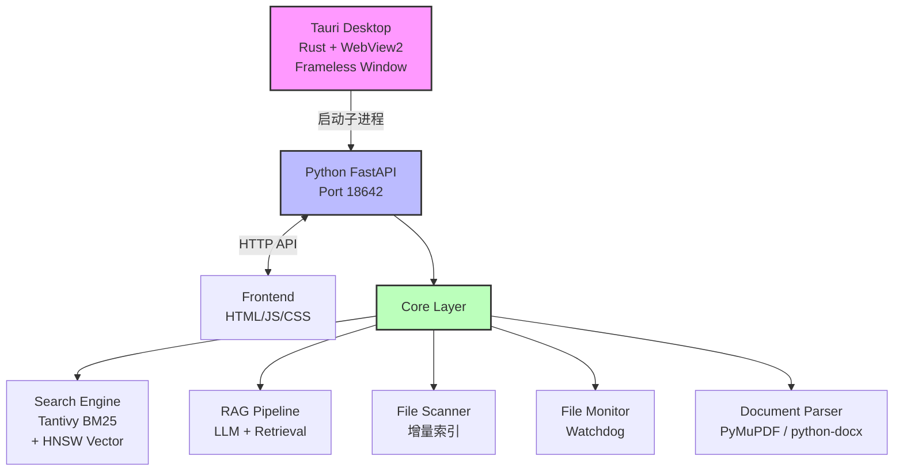

# File Tools

<h4 align="center">基于 Python 的本地文件智能管理工具 — 高效文件扫描、语义检索与 AI 增强问答。</h4>

<p align="center">
  <a href="LICENSE">
    
  </a>
  <a href="pyproject.toml">
    
  </a>
  <a href="pyproject.toml">
    
  </a>
  <a href="https://github.com/Dry-U/File-tools">
    
  </a>
</p>

<br>

<p align="center">
  <a href="https://github.com/Dry-U/File-tools">
    
  </a>
</p>

<p align="center">
  <a href="#快速开始">快速开始</a> •
  <a href="#核心特性">核心特性</a> •
  <a href="#技术架构">技术架构</a> •
  <a href="#项目结构">项目结构</a> •
  <a href="#配置">配置</a> •
  <a href="#构建">构建</a> •
  <a href="#测试">测试</a> •
  <a href="#许可证">许可证</a>
</p>

---

## 快速开始

```bash
# 克隆项目
git clone https://github.com/Dry-U/File-tools.git
cd File-tools

# 安装依赖
uv sync

# 启动 Tauri 桌面应用
npm run tauri dev
```

**环境要求：** Python 3.9+ | Windows 10/11 | 8GB RAM（推荐）

---

## 核心特性

- 🔍 **混合检索** — Tantivy 全文检索 + HNSWLib 向量检索，RRF 排序融合
- 🤖 **智能问答** — RAG 技术，支持多会话历史，引用溯源
- 📄 **多格式支持** — PDF、Word、Excel、PPT、Markdown、TXT
- ⚡ **实时监控** — 文件变化自动增量更新索引
- 💾 **设置持久化** — 前端配置直接写入 `config.yaml`
- 🛡️ **隐私保护** — 本地运行，数据不上传
- 📊 **性能优异** — 10 万+ 文档支持，毫秒级检索

---

## 技术架构



**核心技术栈：**

| 组件 | 技术选型 | 说明 |
|------|---------|------|
| 桌面框架 | Tauri 2.x (Rust) | WebView2 原生窗口 |
| API 框架 | FastAPI + Uvicorn | 高性能异步 API |
| 全文检索 | Tantivy (Rust) | 毫秒级 BM25 检索 |
| 向量检索 | HNSWLib | 近似最近邻搜索 |
| 嵌入模型 | fastembed (bge-small-zh) | 轻量高速 |
| LLM 推理 | llama-cpp-python / OpenAI API | 按需启用 |
| 文档解析 | PyMuPDF + pdfplumber | 10s 超时保护 |

---

## 项目结构

```
File-tools/
├── main.py                    # Python FastAPI 入口
├── config.yaml                # 配置文件
├── pyproject.toml            # Python 依赖
├── package.json              # Node.js 依赖 (Tauri CLI)
│
├── src-tauri/                 # Tauri 桌面应用 (Rust)
│   ├── Cargo.toml            # Rust 依赖
│   ├── tauri.conf.json       # Tauri 配置
│   ├── build.rs             # 构建脚本
│   ├── src/
│   │   ├── main.rs          # 入口 (启动 Python)
│   │   └── lib.rs           # 库入口
│   └── bin/                  # PyInstaller 打包的后端
│
├── backend/                   # Python 后端
│   ├── api/                  # API 接口层
│   │   ├── main.py           # FastAPI 应用
│   │   ├── models.py         # 数据模型
│   │   ├── dependencies.py   # 依赖注入
│   │   └── routes/           # 路由模块
│   │       ├── search.py     # 搜索/预览
│   │       ├── chat.py       # 聊天/会话
│   │       ├── config.py     # 配置管理
│   │       ├── directory.py  # 目录管理
│   │       └── system.py     # 系统路由
│   │
│   ├── core/                 # 核心业务逻辑
│   │   ├── search_engine.py # 搜索引擎（混合检索）
│   │   ├── rag_pipeline.py  # RAG 问答流水线
│   │   ├── index_manager.py # 索引管理器
│   │   ├── file_scanner.py  # 文件扫描器
│   │   ├── file_monitor.py  # 文件监控器
│   │   ├── document_parser.py # 文档解析器
│   │   ├── query_processor.py # 查询处理器
│   │   ├── embedding_manager.py # 嵌入管理
│   │   └── vram_manager.py  # VRAM 管理
│   │
│   └── utils/               # 工具模块
│       ├── config_loader.py  # 配置加载
│       ├── logger.py         # 日志系统
│       └── app_paths.py     # 路径工具
│
├── frontend/                  # 前端界面
│   ├── index.html           # 主页面
│   └── static/              # 静态资源
│       ├── css/             # 样式表
│       ├── js/              # JavaScript 模块
│       │   └── modules/
│       │       ├── tauri-api.js  # Tauri API 封装
│       │       ├── search.js     # 搜索模块
│       │       ├── chat.js      # 聊天模块
│       │       ├── settings.js  # 设置模块
│       │       └── ...
│       └── logo.ico        # 应用图标
│
├── tests/                    # 测试代码
│   ├── unit/                # 单元测试
│   ├── integration/         # 集成测试
│   ├── api/                 # API 测试
│   └── e2e/                 # E2E 测试
│
├── data/                     # 运行时数据
│   ├── tantivy_index/      # Tantivy 全文索引
│   ├── hnsw_index/         # HNSW 向量索引
│   ├── metadata/           # 元数据
│   └── logs/               # 日志
│
├── scripts/                  # 工具脚本
├── docs/                    # 文档
│   ├── USAGE_GUIDE.md      # 使用手册
│   ├── DEVELOPER_GUIDE.md  # 开发指南
│   └── CONTRIBUTING.md    # 贡献指南
│
├── build_pyinstaller.py     # PyInstaller 构建脚本
└── uv.lock                  # 依赖锁定文件
```

---

## 配置

编辑 `config.yaml` 调整参数：

```yaml
# 扫描路径
file_scanner:
  scan_paths:
    - "C:/Users/YourName/Documents"

# 监控目录
monitor:
  enabled: true
  directories:
    - "C:/Users/YourName/Documents"

# 搜索权重（60% 文本 + 40% 向量）
search:
  text_weight: 0.6
  vector_weight: 0.4

# AI 问答（按需启用）
ai_model:
  enabled: true
  mode: "api"                    # "local" (WSL) 或 "api" (远程)
  api:
    provider: "siliconflow"
    api_url: "https://api.siliconflow.cn/v1/chat/completions"
    api_key: "your-api-key"
    model_name: "deepseek-ai/DeepSeek-V2.5"
```

**API 端点：**

| 类别 | 端点 | 说明 |
|------|------|------|
| 健康检查 | `GET /api/health` | 服务状态 |
| 搜索 | `POST /api/search` | 混合检索 |
| 预览 | `POST /api/preview` | 文件内容预览 |
| 问答 | `POST /api/chat` | RAG 对话 |
| 会话 | `GET /api/sessions` | 会话列表 |
| 配置 | `GET/POST /api/config` | 配置管理 |
| 索引 | `POST /api/rebuild-index` | 重建索引 |

完整 API 文档见 [开发者指南](docs/DEVELOPER_GUIDE.md)。

---

## 构建

**使用 PyInstaller + Tauri 构建桌面应用：**

```bash
# 开发模式（热重载）
npm run tauri dev

# 发布构建（生成安装包）
npm run tauri build

# 或分步构建
python build_pyinstaller.py    # 1. 构建 Python 后端
npm run tauri build           # 2. 构建 Tauri + 安装包
```

**构建产物：**

| 平台 | 格式 | 路径 |
|------|------|------|
| Windows | NSIS 安装程序 | `src-tauri/target/release/bundle/nsis/*.exe` |
| Windows | MSI 安装包 | `src-tauri/target/release/bundle/msi/*.msi` |
| Windows | 便携版 | `src-tauri/target/release/filetools.exe` |
| Linux | DEB 包 | `src-tauri/target/release/bundle/deb/*.deb` |
| Linux | AppImage | `src-tauri/target/release/bundle/appimage/*.AppImage` |
| macOS | DMG 安装包 | `src-tauri/target/release/bundle/dmg/*.dmg` |

**前置要求：**
- Rust 1.70+ (`rustup update`)
- Node.js 18+
- Python 3.9+ with `uv sync`

---

## 测试

```bash
# 运行所有测试
pytest tests/ -v

# 按类别运行
pytest tests/unit/ -v          # 单元测试
pytest tests/integration/ -v   # 集成测试
pytest tests/api/ -v           # API 测试
pytest tests/e2e/ -v          # E2E 测试

# 生成 Allure 报告
python scripts/run_tests.py --allure
python scripts/run_tests.py unit --allure

# 报告位置
# - HTML: reports/test_report.html
# - 覆盖: reports/coverage/index.html
# - Allure: reports/allure-report/index.html
```

---

## 许可证

MIT License — 详见 [LICENSE](LICENSE)

Copyright (c) 2024-2026 Darian (Dar1an@126.com)

---

**基于 Tauri + Python FastAPI + Tantivy + HNSWLib 构建** | **Rust 驱动桌面，Python 驱动智能**
