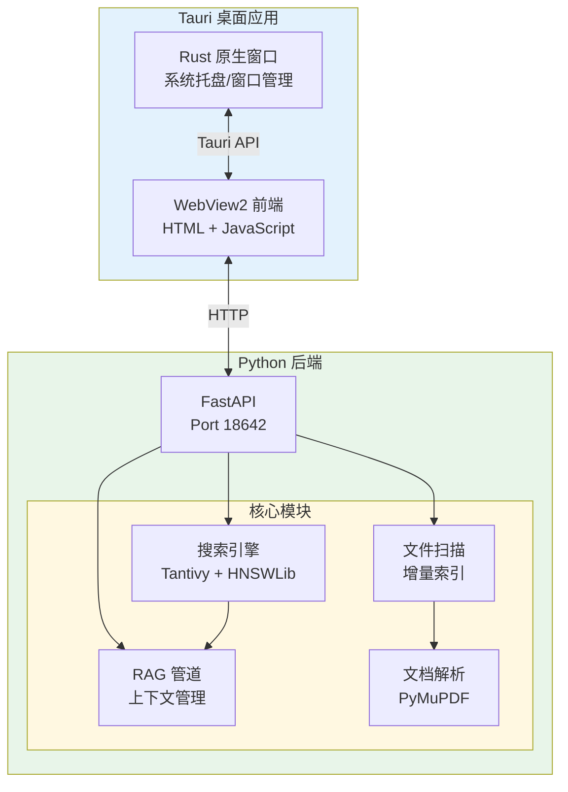

# 贡献指南

感谢您对 FileTools 项目的关注！我们欢迎各种形式的贡献，包括但不限于代码提交、问题反馈、文档改进等。

---

## 目录

- [欢迎贡献](#欢迎贡献)
- [开发环境设置](#开发环境设置)
- [代码规范](#代码规范)
- [测试指南](#测试指南)
- [提交规范](#提交规范)
- [构建说明](#构建说明)
- [问题反馈](#问题反馈)

---

## 欢迎贡献

我们欢迎以下形式的贡献：

- **代码提交**：修复 bug、实现新功能、优化性能
- **问题反馈**：报告 bug、提出功能建议
- **文档完善**：改进文档、补充示例
- **测试用例**：编写测试用例，提高代码覆盖率

### 贡献流程

1. Fork 本仓库
2. 创建特性分支 (`git checkout -b feature/your-feature`)
3. 进行开发并提交更改
4. 推送分支 (`git push origin feature/your-feature`)
5. 创建 Pull Request

---

## 开发环境设置

### 环境要求

- Python 3.9+ (推荐 3.11/3.12)
- Node.js 18+ (用于 Tauri CLI)
- Rust 1.70+ (用于 Tauri)
- Windows 10/11
- 8GB+ RAM (推荐)

### 1. 克隆项目

```bash
git clone https://github.com/Dariandai/File-tools.git
cd File-tools
```

### 2. 安装 Python 依赖

推荐使用 `uv` 进行依赖管理：

```bash
# 安装 uv (如未安装)
pip install uv

# 安装项目依赖
uv sync

# 安装开发依赖 (包含测试、lint 工具)
uv sync --group dev
```

### 3. 安装 Node.js 依赖 (Tauri CLI)

```bash
npm install
```

### 4. 配置 IDE

推荐使用 VS Code 或 PyCharm：

**VS Code 配置 (.vscode/settings.json)**:

```json
{
  "python.defaultInterpreterPath": ".venv/Scripts/python.exe",
  "python.linting.enabled": true,
  "python.linting.ruffEnabled": true,
  "python.formatting.provider": "black",
  "python.analysis.typeCheckingMode": "basic",
  "[python]": {
    "editor.defaultFormatter": "ms-python.black",
    "editor.formatOnSave": true
  },
  "[javascript]": {
    "editor.defaultFormatter": "esbenp.prettier-vscode",
    "editor.formatOnSave": true
  }
}
```

---

## 代码规范

### Python 代码规范

项目使用以下工具进行代码质量控制：

| 工具 | 用途 | 命令 |
|------|------|------|
| Ruff | Lint + 格式化 | `ruff check .` / `ruff format .` |
| Black | 代码格式化 | `black .` |
| MyPy | 类型检查 | `mypy backend/` |
| Bandit | 安全检查 | `bandit -r backend/` |

**规范要点：**

1. 遵循 PEP 8 规范
2. 使用类型注解（尤其在新代码中）
3. 所有公共函数/类必须有文档字符串
4. 导入顺序：标准库 → 第三方库 → 本地模块
5. 行长度限制：88 字符 (Black 默认)

### JavaScript 代码规范

1. 遵循 ES6+ 规范
2. 使用 Prettier 进行格式化
3. 使用有意义的变量命名
4. 注释应解释「为什么」而非「是什么」

---

## 测试指南

### 测试框架

项目使用 pytest 作为主要测试框架，配合以下插件：

- pytest-asyncio: 异步测试支持
- pytest-cov: 代码覆盖率
- pytest-html: HTML 报告生成
- pytest-playwright: E2E 测试
- allure-pytest: 美观测试报告

### 运行测试

```bash
# 运行所有测试
pytest tests/ -v

# 按测试级别运行
pytest tests/unit/ -v          # 单元测试
pytest tests/integration/ -v   # 集成测试
pytest tests/api/ -v           # API 测试
pytest tests/e2e/ -v           # E2E 测试

# 按功能标记运行
pytest -m "feature_search" -v  # 搜索功能测试
pytest -m "feature_chat" -v    # 聊天功能测试
pytest -m "feature_index" -v   # 索引功能测试

# 运行特定测试文件
pytest tests/unit/test_file_scanner.py -v
```

### 生成测试报告

```bash
# 使用脚本运行测试 (推荐)
python scripts/run_tests.py --allure

# 仅生成 pytest HTML 报告
pytest tests/ --html=reports/test_report.html --self-contained-html

# 生成覆盖率报告
pytest tests/ --cov=backend --cov-report=html:reports/coverage
```

**报告位置：**

| 报告类型 | 路径 |
|----------|------|
| pytest HTML 报告 | `reports/test_report.html` |
| 覆盖率报告 | `reports/coverage/index.html` |
| Allure 报告 | `reports/allure-report/index.html` |

---

## 提交规范

### Commit Message 格式

项目采用 Conventional Commits 规范：

```
<type>(<scope>): <subject>

[optional body]

[optional footer]
```

### Type 类型

| Type | 说明 |
|------|------|
| `feat` | 新功能 |
| `fix` | Bug 修复 |
| `docs` | 文档变更 |
| `style` | 代码格式 (不影响功能) |
| `refactor` | 重构 (非功能变更) |
| `perf` | 性能优化 |
| `test` | 测试相关 |
| `chore` | 构建/工具变更 |

### Scope 范围

| Scope | 说明 |
|-------|------|
| `search` | 搜索功能 |
| `chat` | 聊天功能 |
| `index` | 索引功能 |
| `config` | 配置功能 |
| `parser` | 文档解析 |
| `api` | API 层 |
| `ui` | 前端界面 |
| `build` | 构建系统 |

### 示例

```bash
# 新功能
git commit -m "feat(search): 添加混合搜索权重配置"

# Bug 修复
git commit -m "fix(index): 修复大文件索引内存溢出问题"

# 文档更新
git commit -m "docs(readme): 更新快速开始指南"
```

---

## 构建说明

### Tauri 桌面应用构建

Tauri 桌面应用包含 Rust 原生窗口和 Python 后端：

```bash
# 开发模式 (热重载)
npm run tauri dev

# 生产构建
npm run tauri build

# 仅构建 Python 后端
python build_pyinstaller.py
```

### 构建产物位置

```bash
# Windows
src-tauri/target/release/filetools.exe              # Tauri 可执行文件
src-tauri/target/release/bundle/nsis/*.exe        # NSIS 安装包
src-tauri/target/release/bundle/msi/*.msi           # MSI 安装包
src-tauri/bin/filetools-backend.exe                 # PyInstaller 打包的后端
```

 项目架构说明



**前后端分离说明：**

**前后端分离说明：**

- **前端**：纯 HTML/CSS/JavaScript，通过 Tauri 的 WebView2 运行
- **后端**：Python FastAPI，通过 HTTP API 与前端通信
- **桌面**：Tauri (Rust) 管理窗口、系统托盘、本地文件访问
- **通信**：前端通过 `tauri-api.js` 模块调用后端 API

---

## 问题反馈

### 反馈方式

1. **GitHub Issues**：用于报告 bug、提出功能请求
2. **GitHub Discussions**：用于讨论问题、寻求帮助
3. **Pull Request**：用于提交代码修复和改进

### 联系方式

- 邮箱：Dar1an@126.com
- GitHub：https://github.com/Dariandai/File-tools

---

## 附录

### 常用开发命令速查

```bash
# 依赖管理
uv sync                    # 安装依赖
uv sync --group dev        # 安装开发依赖
uv add <package>           # 添加依赖
uv tree                    # 查看依赖树

# 代码质量
uv run ruff check .       # 代码检查
uv run ruff format .      # 代码格式化
uv run mypy backend/      # 类型检查

# 测试
pytest tests/ -v          # 运行所有测试

# 构建
npm run tauri dev         # 开发模式
npm run tauri build       # 生产构建

# Git
git checkout -b feature/xxx    # 创建特性分支
git commit -m "..."            # 提交
git push origin feature/xxx      # 推送
```

### 相关文档

- [使用指南](docs/USAGE_GUIDE.md)
- [开发者指南](docs/DEVELOPER_GUIDE.md)
- [README](README.md)
